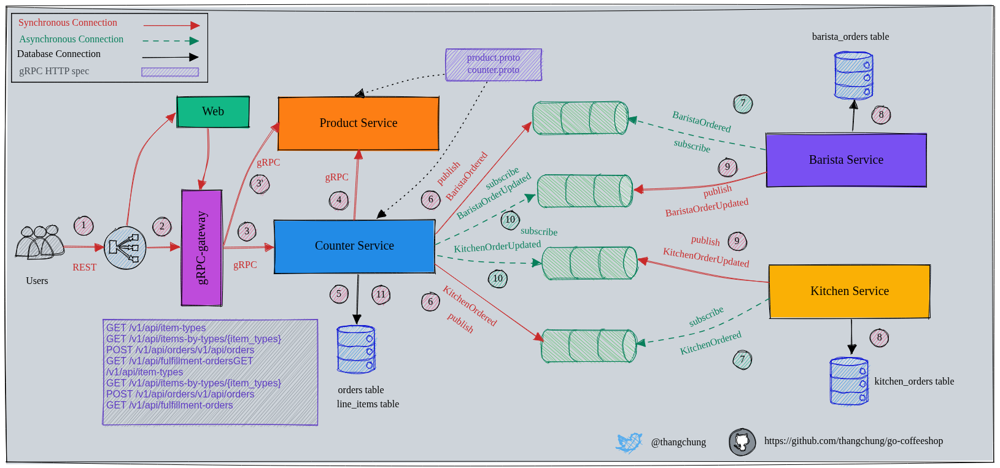
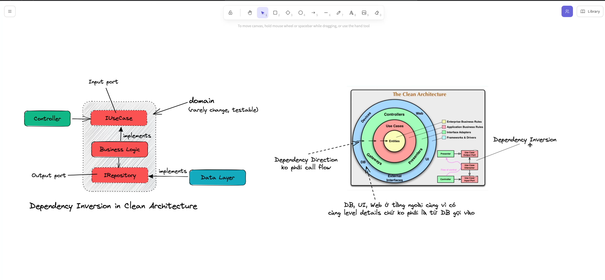

# Coffeeshop

A production-ready microservices application built with **NestJS** and adherence to Clean Architecture. This project is inspired by the well-known [go-coffeeshop](https://github.com/thangchung/go-coffeeshop) repository.

---

## Architecture Overview

The application is split into highly decoupled microservices, each representing a distinct bounded context within the coffee shop domain. By applying Clean Architecture, business logic (Core Domain) is completely isolated from framework-specific details (NestJS, TypeORM, transport layers).

### System Diagram

- System Architecture from [go-coffeeshop](https://github.com/thangchung/go-coffeeshop) 
  

- Clean Architecture from [viettranx](https://github.com/viettranx)


### Core Microservices

- **Counter Service:** The entry point for customers. It handles order placements, processes payments, and acts as the orchestrator for initiating the fulfillment workflow.
- **Product Service:** Manages the store catalog, including coffee types, pastries, pricing, ingredients, and inventory metadata.
- **Kitchen Service:** Handles orders for baked goods and food items (e.g., Croissants, Muffins). It manages a queue of food items to be prepared.
- **Barista Service:** The heart of the drink fulfillment. It manages the queue for espresso-based and brewed drinks (e.g., Cappuccino, Latte), simulating preparation times for each drink type.

---

## Clean Architecture Layering

Each microservice is structured into concentric layers to ensure maintainability, testability, and independence from external tools:

```text
src/
├── 01.domain/          # Core Enterprise Logic (Entities, Value Objects, Repository Interfaces)
├── 02.application/     # Business Use Cases (Commands, Queries, Event Handlers)
├── 03.infrastructure/  # External Frameworks (TypeORM Entities, Repositories, DB Migrations)
└── 04.presentation/    # Entry Points (NestJS Controllers, Grpc/RabbitMQ Transport Adapters)
```
